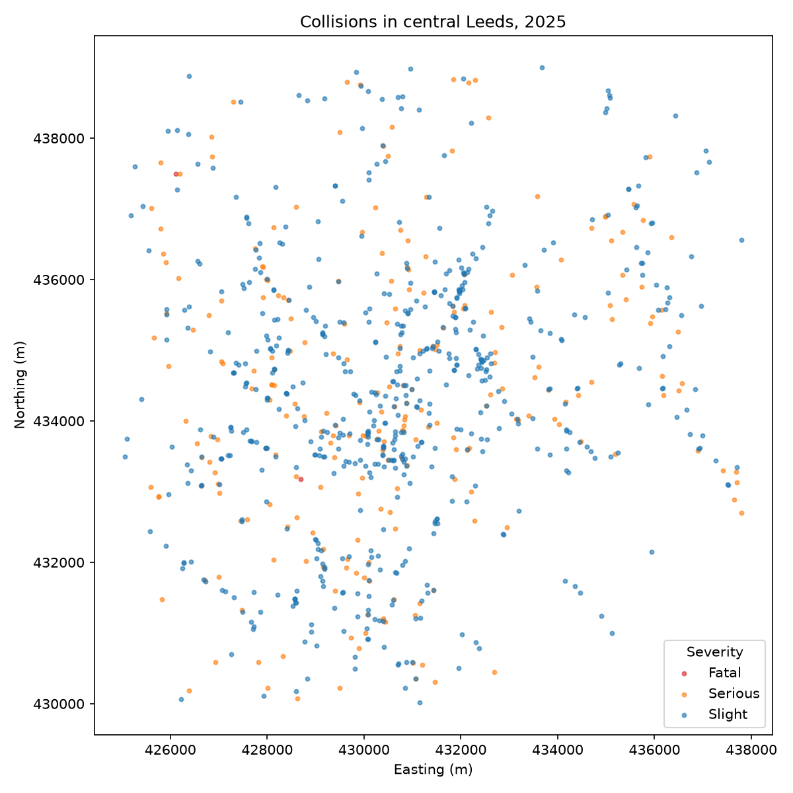

# stats19py


Python port of the [R `stats19`
package](https://github.com/ropensci/stats19) (v4.1.0-dev), built from
first principles and verified for parity against the R reference
outputs.

- **Repo:** `Robinlovelace/stats19py`
- **PyPI name:** `stats19` (free as of 2026-08-01)
- **License:** GPL-3.0-or-later (matches the R package)
- **Stack:** Python 3.11+, `uv`, `ruff`, pyright (Pylance-standard),
  pytest
- **Spatial:** DuckDB Spatial (not geopandas)

## Install

``` bash
uv sync          # create env, install deps
uv run pytest    # run tests
```

## Quick start

Download and read STATS19 collisions for a year. The data live in the
directory given by the `STATS19_DOWNLOAD_DIRECTORY` environment variable
(default: `./data`).

``` python
import stats19

# Collisions in 2025 (downloads if not already on disk)
collisions = stats19.get_stats19(year=2025, type="collision", silent=True)
print(f"{collisions.shape[0]} collisions in 2025, {collisions.shape[1]} columns")
print(collisions["collision_severity"].value_counts().to_dict())
```

    101525 collisions in 2025, 42 columns
    {'Slight': 74881, 'Serious': 25191, 'Fatal': 1453}

Prefer the per-table helpers? `get_collisions()`, `get_casualties()` and
`get_vehicles()` wrap `get_stats19()` with the `type` pre-filled,
mirroring the `read_*()` family (the same API shape as the R package’s
new `get_collisions()` etc. from
[ropensci/stats19#320](https://github.com/ropensci/stats19/pull/320)):

``` python
collisions2 = stats19.get_collisions(year=2025, silent=True)
print(f"{collisions2.shape[0]} collisions via get_collisions()")
```

    101525 collisions via get_collisions()

## Central Leeds collisions, 2025

Filter collisions to a bounding box around Central Leeds (British
National Grid coordinates, EPSG:27700) and map them with matplotlib. The
coordinates come straight from the STATS19 easting/northing fields.

``` python
import matplotlib
matplotlib.use("Agg")
import matplotlib.pyplot as plt

# Central Leeds bounding box (OSGB36 / EPSG:27700)
bbox = {
    "easting_min": 425000, "easting_max": 438000,
    "northing_min": 430000, "northing_max": 439000,
}

central_leeds = collisions[
    collisions["location_easting_osgr"].between(bbox["easting_min"], bbox["easting_max"])
    & collisions["location_northing_osgr"].between(bbox["northing_min"], bbox["northing_max"])
]
print(f"{len(central_leeds)} collisions in central Leeds, 2025")

fig, ax = plt.subplots(figsize=(8, 8))
colors = {"Fatal": "#d62728", "Serious": "#ff7f0e", "Slight": "#1f77b4"}
for severity, group in central_leeds.groupby("collision_severity"):
    ax.scatter(
        group["location_easting_osgr"], group["location_northing_osgr"],
        s=8, alpha=0.6, label=severity, color=colors.get(severity, "grey"),
    )
ax.set_xlabel("Easting (m)")
ax.set_ylabel("Northing (m)")
ax.set_title("Collisions in central Leeds, 2025")
ax.legend(title="Severity")
fig.tight_layout()
plt.savefig("images/leeds-collisions-2025.png", dpi=150)
plt.show()
```

    850 collisions in central Leeds, 2025



## Spatial output via DuckDB Spatial

Convert tabular STATS19 data to spatial points using DuckDB’s spatial
extension (EPSG:27700, optionally transformed to lon/lat EPSG:4326):

``` python
from stats19 import format_sf

sf = format_sf(central_leeds, lonlat=True)
print(f"{len(sf)} spatial points with lon/lat geometry (DuckDB spatial)")
```

    850 spatial points with lon/lat geometry (DuckDB spatial)

## Cleaning vehicle makes and models

``` python
import pandas as pd
from stats19 import clean_make, clean_model

examples = pd.Series(["FORD FIESTA", "LAND ROVER DISCOVERY", "VW GOLF"])
print(clean_make(examples).tolist())
print(clean_model(examples).tolist())
```

    ['Ford', 'Land Rover', 'Volkswagen']
    ['Fiesta', 'Discovery', 'Golf']

## API overview

| Function | Purpose |
|----|----|
| `dl_stats19(year, type)` | Download CSVs to the data directory |
| `get_collisions(year)` / `get_casualties(year)` / `get_vehicles(year)` | Download + read + format, one table type (wrappers over `get_stats19`) |
| `read_collisions(year)` / `read_casualties(year)` / `read_vehicles(year)` | Read + format tables |
| `get_stats19(year, type)` | Download + read + format, R-style (general escape hatch) |
| `list_files(year, table)` | Discover available files |
| `format_sf(df)` | Spatial points via DuckDB Spatial |
| `clean_make()` / `clean_model()` / `clean_make_model()` | Clean vehicle makes/models |
| `get_MOT(vrm)` / `get_ULEZ(vrm)` | DVSA MOT / TfL ULEZ API lookups |

## Environment variables

| Variable | Purpose |
|----|----|
| `STATS19_DOWNLOAD_DIRECTORY` | Where STATS19 CSVs are stored/read (default `./data`) |
| `MOTKEY` | DVSA MOT History API key for `get_MOT()` |

## Reproducibility & provenance

- Golden schema: `schema.csv` at the repo root, generated from the R
  package data (`scripts/build_schema.py --write`), cross-validated
  against the DfT official data guide. Provenance:
  `src/stats19/data/schema_provenance.json`.
- R↔Python parity harness: `scripts/compare_r_python.py` (100%
  concordance on 2024/2025 formatted output, verified against R
  v4.1.0-dev).

This document is generated from `readme.qmd` with:

``` bash
quarto render readme.qmd
```
